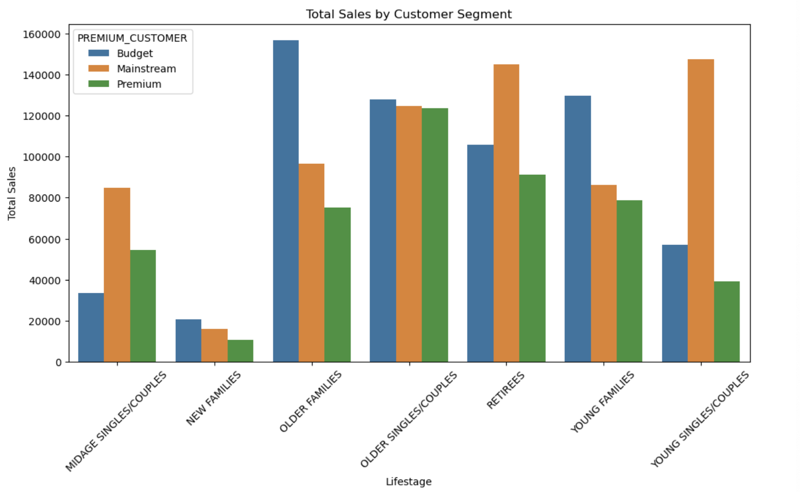
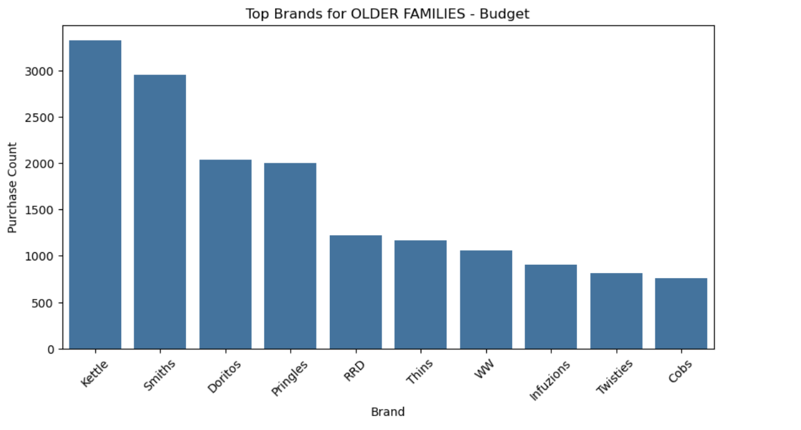
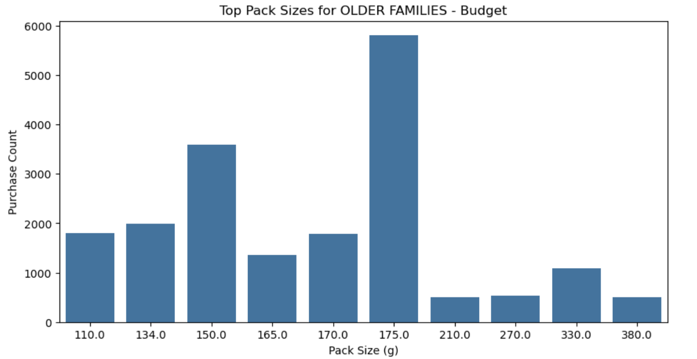
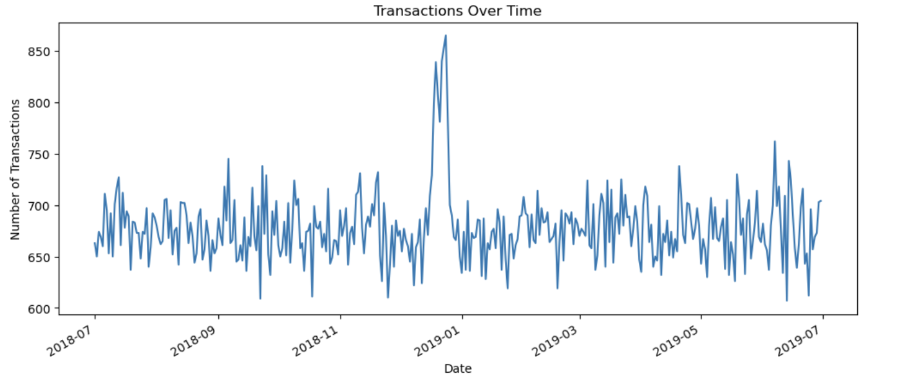

# Quantium Customer Analytics

## Project Overview
Analysed supermarket transaction and customer purchase behaviour data to identify high-value customer segments, purchasing patterns, and sales drivers within the chips category.

The project focused on customer segmentation, product preferences, and purchasing behaviour to support strategic recommendations for category management.

---

## Tools Used
- Python
- Pandas
- NumPy
- Matplotlib
- Seaborn
- SciPy
- Jupyter Notebook

---

## Project Workflow
1. Data loading and exploration
2. Data cleaning and validation
3. Feature engineering
4. Customer segmentation analysis
5. Business insights and recommendations

---

## Key Insights
- Older Families (Budget) generated the highest total sales
- Mainstream Young Singles/Couples were strong contributors to sales
- Family segments purchased higher chip volumes
- Mainstream Young Singles/Couples paid higher average unit prices
- Kettle, Smiths, Doritos, and Pringles were the most preferred brands
- 175g and 150g were the most popular pack sizes

---

## Recommendation
The business should focus on high-performing customer segments through targeted promotions, preferred brands, and convenient pack sizes to improve category sales performance.

---

## Key Visualisations

### Customer Segment Sales

### Brand Preferences

### Pack Size Preferences

### Transaction Trends

